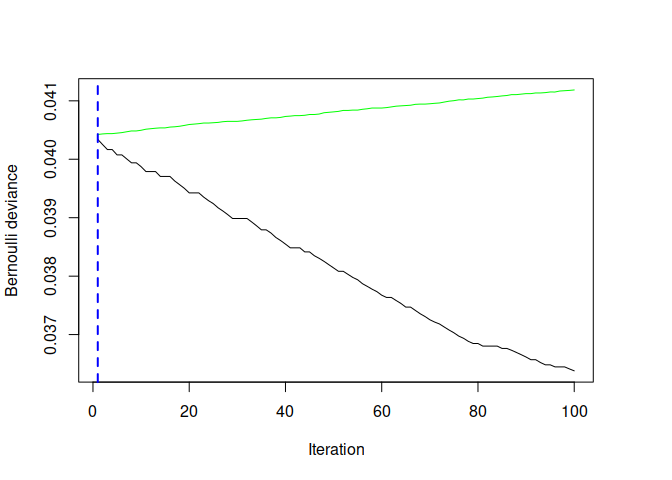
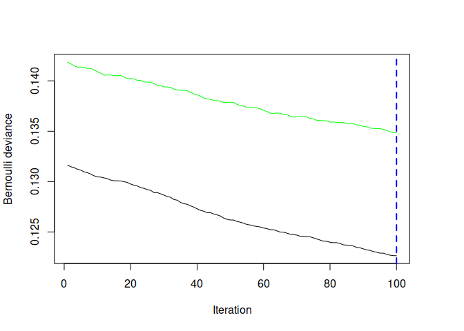
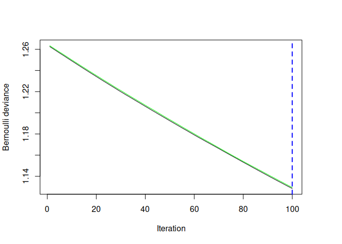

<!-- README.md is generated from README.Rmd. Please edit that file -->
undi
====

[](https://travis-ci.org/jongbinjung/undi) [](https://codecov.io/github/jongbinjung/undi?branch=master)

Installation
------------

You can install undi from github with:

``` r
# install.packages("devtools")
devtools::install_github("jongbinjung/undi")
```

Example
-------

``` r
library(undi)
library(tidyverse)
inv_logit <- stats::binomial()$linkinv

N <- 2000
set.seed(1)
data <- tibble(id = rep(1:N)) %>%
  mutate(
  m = rnorm(N, 0, 1),
  x = factor(rep(c("red", "blue"), N / 2)),
  x = fct_relevel(x, "red"),
  z = rnorm(N, m, 2),
  c = rnorm(N, m, 2),
  e1 = rnorm(N, 0, 0.05),
  e2 = rnorm(N, 0, 0.05),
  risk = 1 + 0.05 * (x == "blue") + 0.25 * z + c + e1,
  a = inv_logit(risk + e2) > .5,
  y = inv_logit(risk) > .5
  )

example_undi <-
  undi(
  a ~ x + z + c,
  data,
  outcome = "y",
  cv.folds = 2,
  distribution = "bernoulli"
  )
#> Using cv method...
```



    #> Using cv method...



    #> Using cv method...



``` r

# Sensitivity with uniform parameters
undisens(
  example_undi,
  q = .45,
  dp = log(1.8),
  d0 = log(2),
  d1 = log(1.5)
  )
#>    term estimate std.error statistic   p.value controls
#> 3 xblue  0.02324  0.005581     4.164 3.196e-05   risk__

# Sensitivity with parameters assigned to levels of the grouping variable
undisens(
  example_undi,
  q = c(.45, .55),
  dp = c(-log(1.2), log(1.5)),
  d0 = c(-log(3), log(3)),
  d1 = c(0, log(1.8))
  )
#>    term estimate std.error statistic  p.value controls
#> 2 xblue  0.02282  0.007369     3.097 0.001969   risk__
```
